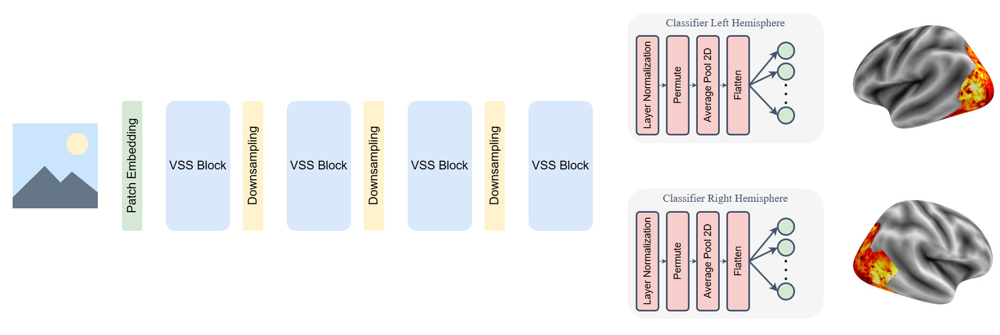

# fMRI-VisionMamba

Simple brain/fMRI encoding model based on VMamba [[1]](#1) ([link to the original repository](https://github.com/MzeroMiko/VMamba)).

## Architecture


## Training

1. Activate the *environment.yml* environment or install the corresponding packages. 

2. Prepare training and test data: images and fMRI responses.

3. Run *train.py* script from the src folder.

#### Example
```bash
python train.py \
--train_img_dir=<insert path> \
--test_img_dir=<insert path> \
--lh_fmri_path=<insert path> \
--rh_fmri_path=<insert path> \
--num_v_lh=<insert number> \
--num_v_rh=<insert number>
```

#### Arguments
* **train_img_dir** - Path to the directory containing training images
* **test_img_dir** - Path to the directory containing test images
* **test_pred_dir** - Path to the directory where to save the predictions for test images
* **lh_fmri_path** - Path to numpy file containing fmri responses to training images for the left hemisphere
* **rh_fmri_path** - Path to numpy file containing fmri responses to training images for the right hemisphere
* **num_v_lh** - Number of vertices in the left hemisphere
* **num_v_rh** - Number of vertices in the right hemisphere
* **device** - Device to use: cuda or cpu
* **lr** - Learning rate
* **num_epochs** - Maximum number of epochs
* **batch_size** - Batch size
* **perc_train** - Percentage of training images within the training directory (the remaining are validation images)
* **ptc_counter** - Patience counter (Max. number of epochs without improvements)
* **lr_drop** - Learning rate drop rate
* **log_freq** - Logging frequency (in number of batches)


## References
<a id="1">[1]</a> Liu Yue, Yunjie Tian, Yuzhong Zhao, Hongtian Yu, Lingxi Xie, Yaowei Wang, Qixiang Ye, and Yunfan Liu. 2024. "VMamba: Visual State Space Model." [*arXiv:2401.10166*](https://arxiv.org/abs/2401.10166).
